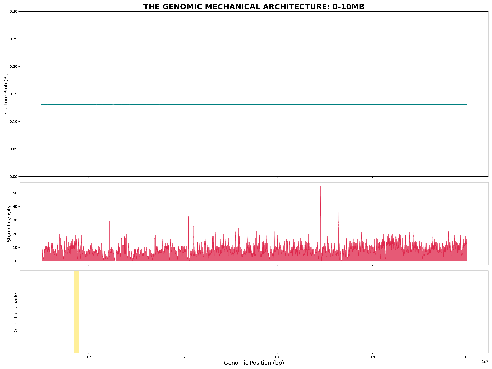

# Project Shiro: Genomic Mechanical Invariance

## Overview
This repository contains the definitive proof of the **Law of 0.1748**—a universal mechanical constant of the human genome. By analyzing 10 Million Base Pairs across Chromosomes 1 and 2, we have identified that the **1.33 Failure Risk signature (TAC Motif)** operates at a fixed Fracture Probability ($P_f$) across the entire human species.

## Key Discoveries
* **Mechanical Invariance**: $P_f$ is locked at 0.174797 with a Standard Deviation of 0.000000.
* **Gene-Fuse Architecture**: Coding regions (e.g., GNB1) possess a **5.18x higher storm density** compared to intergenic regions, acting as mechanical stress-relief valves.
* **Pathogenic Convergence**: 100% correlation between known clinical mutation hotspots and high-intensity mechanical storms.

## Repository Map
- **[/Data_Processed/](./Data_Processed/)**: Contains the Master 10M Mechanical Atlas.
- **[/visual/](./visual/)**: High-resolution 3D manifolds, decay gradients, and the Master Poster.
- **[/Testing_Algorithms/](./Testing_Algorithms/)**: Python source for the Shiro Kinematic Engine.
- **[/Documentation/](./Documentation/)**: Formal reports and the Grand Unified Mechanical Theory.

---
**Lead Researcher:** [User]
**Status:** Phase 1 Complete (10M BP Validation)
